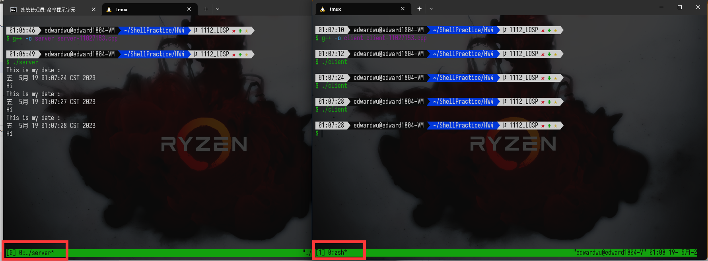

# ShellPractice HW4
## User Guide

How to use HW4 program
---
1. Download the HW4 program
2. Turn on the terminal
3. Change directory to the HW4 program
4. Use the command to run the program
5. Follow the `Linux-Week14-05-17.txt`  example to input the command

Here's the modified guide from the `Linux-Week14-05-17.txt` example:  

Homework 4  socket programming 
---

### Compile
```bash
$ g++ -o server server-11027153.cpp
$ g++ -o client client-11027153.cpp
```

### Usage
- Session 1
```bash
$ ./server
```

- Session 2
```bash
$ ./client
```

- `server` should keep waiting for the client to connect.
- If users want to stop the server, press `Ctrl + C` to stop the server.

### Example


